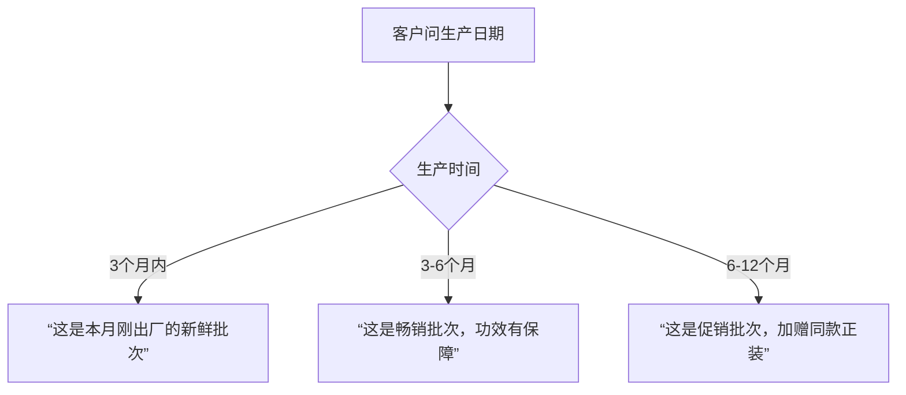
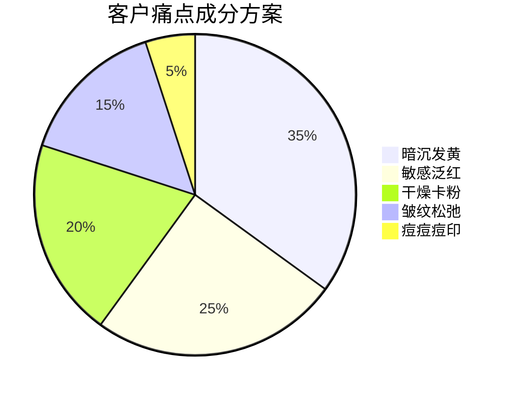
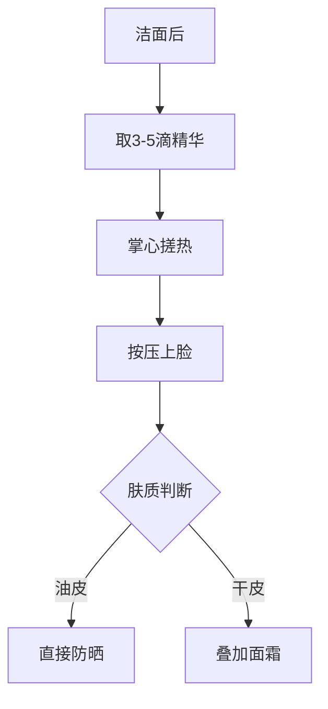
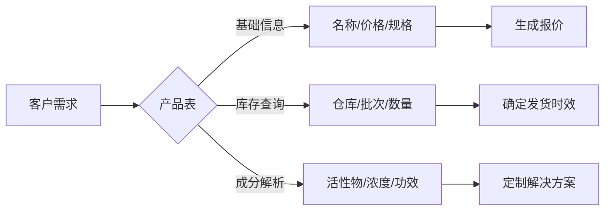

# **皙透源销售实战工具包**

## **一、产品信息闪电查询系统**

### 1. 核心产品速查表（TOP20高频咨询产品）
| 产品图标 | SKU      | 产品名称         | 关键卖点                        | 适用人群          | 价格 | 库存状态 |
| -------- | -------- | ---------------- | ------------------------------- | ----------------- | ---- | -------- |
| 💡        | XT001-30 | 焕亮修护精华液   | 5%烟酰胺+3%B5，28天提亮1.5度    | 暗沉肌/敏感肌     | 299  | 充足     |
| 🌿        | XT002-30 | 焕亮精华(安心版) | 无烟酰胺配方，换季泛红急救      | 孕妇/烟酰胺不耐受 | 329  | 充足     |
| ☀️        | XT005-30 | 防晒乳           | 全波段防护+透明质酸，妆前不打滑 | 通勤族/户外工作者 | 159  | 紧缺     |
| 👁        | XT009-15 | 眼周修护霜       | 10%多肽复合物，4周淡化眼纹      | 熬夜党/初老肌     | 279  | 充足     |
| ✨        | XT014-30 | 抗皱精华         | 类肉毒杆菌肽，8周逆转法令纹     | 35+熟龄肌         | 599  | 预警     |
| 🚑        | XT020-7  | 安瓶精华         | 7天密集修护，改善熬夜垮脸       | 重要场合前急救    | 259  | 充足     |
| ⚡        | XT040-30 | 祛痘印精华       | 4%烟酰胺+积雪草，14天退红       | 痘肌/油皮         | 259  | 紧缺     |
| 🧴        | XT055-50 | 手部防晒         | SPF30 PA+++，防黑防老化         | 开车族/户外工作者 | 159  | 充足     |
| 💆        | XT080-50 | 头皮精华         | 米诺地尔复合配方，防脱生发      | 产后脱发/压力脱发 | 349  | 充足     |

> **使用说明**：  
> 1. 库存状态：  
>    - 🟢 充足(>200件)  🟡 预警(50-200件)  🔴 紧缺(<50件)  
> 2. 遇到紧缺品：*"这款正在补货中，推荐您先用同系列XX产品打底，到货后第一时间通知您"*

### 2. 产品组合推荐矩阵
| 客户需求     | 黄金组合               | 促销方案       | 业绩提升点   |
| ------------ | ---------------------- | -------------- | ------------ |
| **熬夜急救** | 焕亮精华+安瓶精华+眼霜 | 立减100送面膜  | 客单价+35%   |
| **敏感修护** | 安心版精华+修护面霜    | 85折送舒缓小样 | 复购率+20%   |
| **夏日防护** | 防晒乳+VC粉+晒后修复   | 防晒买二送一   | 连带率+40%   |
| **母婴护理** | 安心版精华+妊娠纹霜    | 孕妈专享礼盒   | 新客转化+30% |

---

## **二、库存智能应答指南**

### 1. 库存状态话术库
| 库存状态 | 客户场景     | 应对话术                                                    |
| -------- | ------------ | ----------------------------------------------------------- |
| **充足** | 常规咨询     | "您要的规格全国6仓有货，现在下单明天就能发出"               |
| **预警** | 大单采购     | "目前库存余量支持3套订购，如需更多可协调周边仓库48小时调货" |
| **紧缺** | 指定产品缺货 | "这款本周已补货3次仍供不应求，您可先锁定预售名额享专属折扣" |

### 2. 批次新鲜度应答策略

### 3. 区域调货话术模板
| 客户地区 | 仓库选择 | 配送话术                   |
| -------- | -------- | -------------------------- |
| 江浙沪   | 上海仓   | "今发明至，快递优先派送"   |
| 珠三角   | 广州仓   | "早上下单，下午发货"       |
| 川渝地区 | 成都仓   | "西南专仓，隔日必达"       |
| 紧急需求 | 多仓联动 | "三仓齐发，确保24小时送达" |

---

## **三、成分功效实战话术库**

### 1. 明星成分四维解析
| 成分         | 黄金浓度 | 通俗解读     | 竞品对比优势         | 场景化话术                                                 |
| ------------ | -------- | ------------ | -------------------- | ---------------------------------------------------------- |
| **烟酰胺**   | 5%       | 黑色素拦截网 | 比Olay浓度高67%      | "就像给黑色素装GPS拦截器，从源头阻断变黑通路"              |
| **泛醇(B5)** | 3%       | 肌肤急救绷带 | 修丽可B5精华平替     | "泛醇就像皮肤'创可贴'，泛红爆皮时厚涂，2小时压住红警报"    |
| **积雪草**   | 2%       | 肌肤消防员   | 添加量是薇诺娜1.5倍  | "韩国进口积雪草提取物，专门扑灭肌肤'小火苗'，换季维稳神器" |
| **多肽**     | 10%      | 皱纹橡皮擦   | 效果媲美千元贵妇产品 | "类肉毒杆菌肽直接'冻结'表情纹，8周让法令纹隐形"            |

### 2. 成分组合解决方案

| 痛点     | 必推成分           | 场景话术                                                     |
| -------- | ------------------ | ------------------------------------------------------------ |
| **暗沉** | 5%烟酰胺+VC        | "早C晚白组合：早上VC抗氧化，晚上烟酰胺阻断黑色素，14天透亮如打光" |
| **泛红** | B5+积雪草+神经酰胺 | "修护铁三角：B5修墙+积雪草灭火+神经酰胺锁水，7天还你'冷白皮'" |
| **卡粉** | 双分子玻尿酸       | "大小玻尿酸分工作战：小分子深灌水，大分子表面锁水，上妆服帖度提升300%" |
| **皱纹** | 类蛇毒肽+玻尿酸    | "填充+紧致双效：玻尿酸撑起凹陷，类蛇毒肽收紧轮廓，28天逆龄生长" |

---

## **四、高频问题应答锦囊**

### 1. 功效疑虑破解
| 客户质疑       | 科学依据          | 销售应对话术                                                 |
| -------------- | ----------------- | ------------------------------------------------------------ |
| "半个月没效果" | 皮肤代谢周期28天  | "就像种子需要时间发芽，黑色素代谢要完整周期，坚持28天给您惊喜" |
| "停用会反弹吗" | 黑色素持续代谢    | "停用后做好防晒就像锁上美白成果保险箱，定期密集护理效果更持久" |
| "不如XXX明显"  | 个体差异+使用方式 | "配合我们专属的'按压吸收法'（示范手法），吸收率提升50%，效果翻倍" |

### 2. 使用方式指导卡

### 3. 物流售后应急方案
| 问题类型     | 解决流程               | 补偿方案             |
| ------------ | ---------------------- | -------------------- |
| **快递漏液** | 拍摄视频→客服确认→补发 | 补发新品+赠送面膜    |
| **过敏反应** | 停用拍照→提供凭证→退款 | 全额退款+报销检测费  |
| **买贵退差** | 提交截图→审核→返券     | 差价以200%优惠券返还 |
| **赠品漏发** | 核实→补发/置换         | 补发或升级正装产品   |

---

## **五、销售工具包使用指南**

### 1. 三表联动查询卡

### 2. 每日必查清单
1. **紧缺品清单**：红色标注产品（XT005-30防晒乳等）  
2. **新鲜批次**：3个月内生产明星产品（XT001-30批次B2312XX）  
3. **高利润组合**：精华+面霜+眼霜套装（毛利率45%）

### 3. 客户档案记录表
| 客户类型   | 特征           | 推荐产品            | 跟进行动         |
| ---------- | -------------- | ------------------- | ---------------- |
| 精致宝妈   | 关注成分安全   | 安心版精华+妊娠纹霜 | 每月推送孕肌科普 |
| 油痘肌学生 | 预算有限求速效 | 祛痘印精华+净痘凝胶 | 赠送控油小样     |
| 抗老精英   | 注重科技成分   | 抗皱精华+颈霜       | 预约皮肤检测     |

> **黄金话术**：遇到犹豫客户时使用  
> *"您选的这款含5%黄金浓度烟酰胺，配合我们微脂囊技术吸收率提升3倍，现在下单加赠28天用量日历，每天记录蜕变过程！"*

---

**附录：成分功效速记卡**  
✅ **烟酰胺5%**：黑色素拦截网  
✅ **泛醇3%**：肌肤急救绷带  
✅ **积雪草**：敏感灭火器  
✅ **多肽**：皱纹橡皮擦  
✅ **玻尿酸**：深水炸弹  

> 本工具包数据每日8:00更新，随身携带应对各类咨询场景。遇到特殊案例扫码上报，成功解决奖励销售积分！

